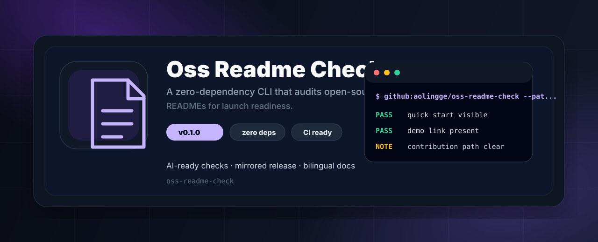
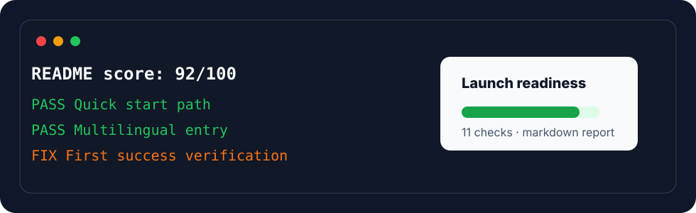

<p align="center">
  
</p>

<h1 align="center">OSS README Check</h1>

<p align="center">
  <b>A zero-dependency CLI that audits whether your README is ready for an open-source launch.</b>
</p>

<p align="center">
  <a href="README.zh-CN.md">简体中文</a>
  ·
  <a href="#quick-start">Quick Start</a>
  ·
  <a href="#checks">Checks</a>
  ·
  <a href="#contributing">Contributing</a>
</p>

<p align="center">
  <a href="https://github.com/aolingge/oss-readme-check/actions/workflows/validate.yml"></a>
  <a href="LICENSE"></a>
  <a href="https://github.com/aolingge/oss-readme-check/releases"></a>
</p>

---

<table>
  <tr>
    <td width="25%" valign="top"><b>Score the front page</b><br />Turn README quality into a visible launch-readiness score.</td>
    <td width="25%" valign="top"><b>Catch missing proof</b><br />Find absent quick starts, screenshots, verification, and trust signals.</td>
    <td width="25%" valign="top"><b>Gate pull requests</b><br />Use `--min-score` in CI before a repo asks for stars.</td>
    <td width="25%" valign="top"><b>Write better docs</b><br />Get concrete fix text instead of vague documentation advice.</td>
  </tr>
</table>

<p align="center">
  
</p>

## Why This Exists

Many repositories ask for stars before the front page answers basic questions:

- What does this project do?
- Who is it for?
- How do I get the first success in under five minutes?
- Can I trust the project enough to try it?

**OSS README Check turns those questions into a repeatable score.**

## Quick Start

Run it in any repository:

```bash
npx github:aolingge/oss-readme-check --path README.md --min-score 80
```

Generate a Markdown report:

```bash
npx github:aolingge/oss-readme-check --markdown > readme-report.md
```

After npm publication, the shorter `npx oss-readme-check` command will be available.

You know it worked when you see:

```text
README score: 80/100
PASS Quick start path
FAIL First success verification
```

## Checks

| Check | Why it matters |
| --- | --- |
| One-line value proposition | Visitors should know the value before scrolling. |
| Quick start path | Users need a copy-pasteable first run. |
| First success verification | Users need to know whether setup worked. |
| Trust badges | CI, license, and release badges reduce uncertainty. |
| Visual anchor | A screenshot, terminal output, or banner improves recall. |
| Scenario entry points | Goal-based navigation beats long documentation dumps. |
| Multilingual entry | English + local language improves reach. |
| Contributing path | Good first issues help a repo grow. |
| Security boundary | Users should not paste secrets into public issues. |
| License visible | Users need to know reuse rights. |

## Example

```bash
oss-readme-check --path README.md --markdown
```

```md
# README Audit Report

Score: **82/100**

| Status | Check | Fix |
| --- | --- | --- |
| PASS | Quick start path | |
| FAIL | First success verification | Tell users how to know the first run succeeded. |
```

## Contributing

Good first contributions:

- Add more checks.
- Improve scoring weights.
- Add templates for README styles.
- Add examples for CLI, web app, template, and library repositories.

Run checks:

```bash
npm test
node src/cli.js --path README.md --min-score 80
```

## License

MIT


## Quality Gate

Use this project as a repeatable gate before an AI agent marks work as done:

- [Quality gate guide](docs/quality-gates.md)
- [Copy-ready GitHub Actions example](examples/github-action.yml)
